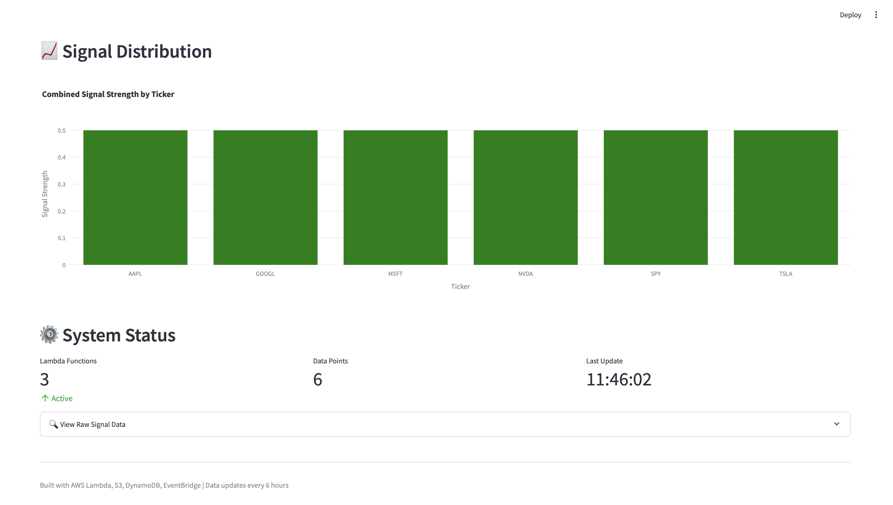

# AWS Trading Signals Platform

A production-ready algorithmic trading signal generation system built on AWS in 1 day.

## 📊 Dashboard Preview


*Real-time trading signals with BUY/HOLD/SELL recommendations*


*Combined signal strength visualization across all tracked stocks*

## 🎯 Overview

Real-time trading signals combining sentiment analysis from financial news with price data analysis. Fully automated cloud infrastructure processing 6 major stocks (SPY, AAPL, MSFT, GOOGL, NVDA, TSLA).

## ✨ Features

- **Real-time Data Collection** - Yahoo Finance API integration
- **Sentiment Analysis** - Financial news sentiment scoring
- **Automated Signal Generation** - BUY/HOLD/SELL recommendations
- **Live Dashboard** - Interactive data visualization
- **Fully Automated** - EventBridge scheduling (updates every 6 hours)

## 🏗️ Architecture
```
Yahoo Finance API
       ↓
Lambda (Price Data) → S3 Storage
       ↓
Lambda (Sentiment Analysis) → S3 Storage
       ↓
Lambda (Signal Combiner) → DynamoDB
       ↓
Streamlit Dashboard (Real-time Visualization)
```

## 🛠️ AWS Services Used (10+)

- **Lambda** - 3 serverless functions
- **S3** - Data lake storage
- **DynamoDB** - NoSQL database for signals
- **EventBridge** - Automated scheduling
- **CloudWatch** - Monitoring & logging
- **IAM** - Security & permissions

## 📊 Results

- **6 stocks monitored**: SPY, AAPL, MSFT, GOOGL, NVDA, TSLA
- **Data updates**: Every 6 hours (automated)
- **Signal types**: BUY, HOLD, SELL
- **Metrics tracked**: Price, Sentiment Score, Combined Signal

## 🎓 Skills Demonstrated

- AWS Cloud Architecture
- Serverless Computing (Lambda)
- NoSQL Databases (DynamoDB)
- Data Engineering (S3 Data Lake)
- Machine Learning (Sentiment Analysis)
- Event-Driven Architecture
- Dashboard Development (Streamlit)

## 📝 License

MIT License - see [LICENSE](LICENSE) file for details

## 👤 Author

**Kaanishkaa**
- GitHub: [@Kaanishkaa](https://github.com/Kaanishkaa)

---

**Built in 1 day for investment banking portfolio** 🏦
